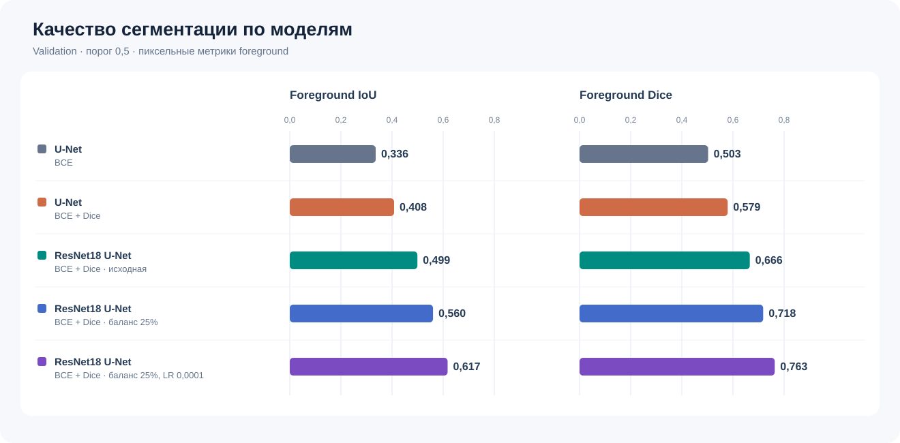
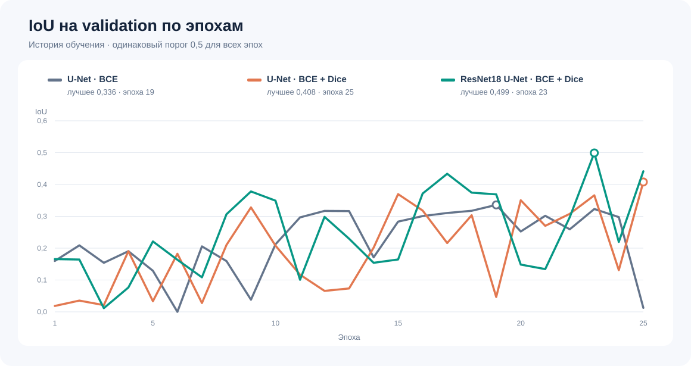
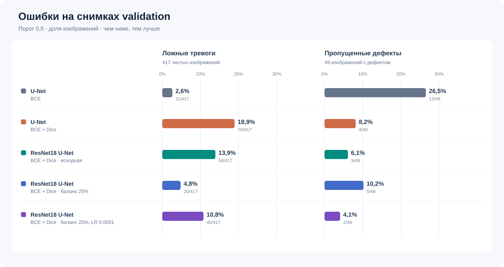
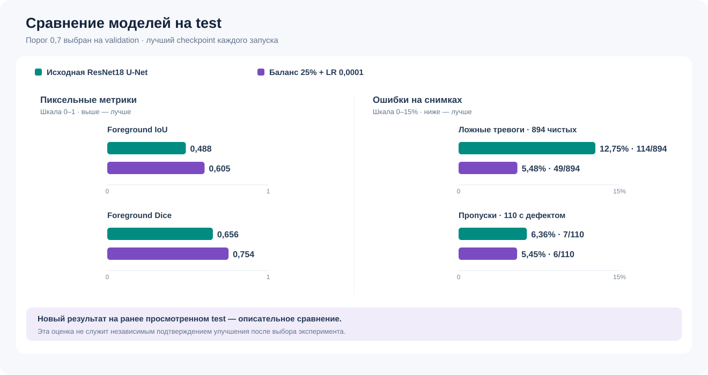
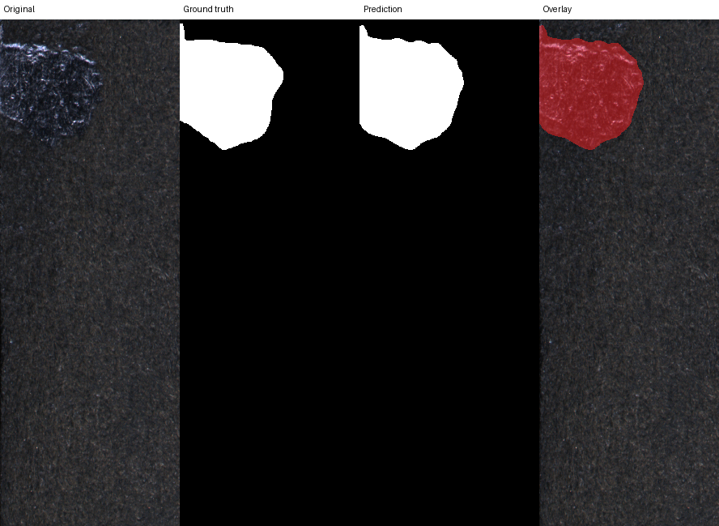
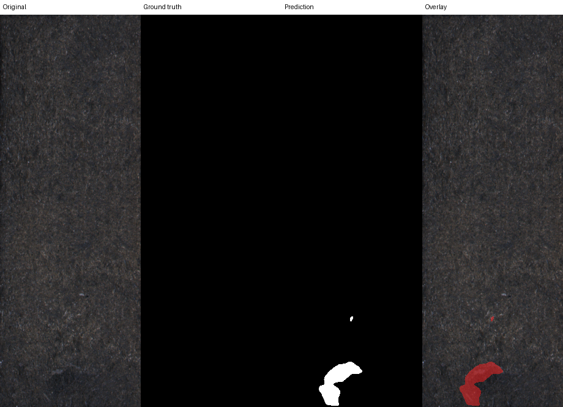

# Surface Defect Segmentation

## Задача

Учебный проект бинарной сегментации дефектов поверхности: модель получает изображение и возвращает маску дефекта. В проекте есть обучение, оценка IoU/Dice, сохранение визуализаций и локальное Gradio demo.

## Данные

[KolektorSDD2](https://www.vicos.si/resources/kolektorsdd2/) содержит изображения производственных поверхностей и маски дефектов. В официальном `train` — 2331 снимок, в `test` — 1004. Из первого выделены `train` (1865, из них 197 с дефектами) и `val` (466, из них 49 с дефектами). Официальный `test` сохранён без изменений (1004, из них 110 с дефектами).

Скачайте датасет с сайта авторов и распакуйте в `data/raw/KolektorSDD2/`, чтобы внутри были `train/` и `test/`. Каждому `<имя>.png` соответствует `<имя>_GT.png`. Файлы `data/splits/{train,val,test}.csv` задают пары изображение–маска. Датасет распространяется по [CC BY-NC-SA 4.0](https://creativecommons.org/licenses/by-nc-sa/4.0/). Сырой датасет и обученные веса не входят в репозиторий; изображения в `reports/examples/` — визуализации на основе KolektorSDD2 и распространяются с указанием источника на тех же условиях.

Авторы KolektorSDD2 — Jakob Božič, Domen Tabernik и Danijel Skočaj; исходные изображения предоставила и разметила Kolektor Group d.o.o. При использовании датасета авторы просят цитировать [Božič et al., *Mixed supervision for surface-defect detection: from weakly to fully supervised learning* (2021)](https://prints.vicos.si/publications/385). Панели в `reports/examples/` объединяют исходные изображения и разметку с предсказанием и наложением. Для кода проекта отдельная лицензия пока не выбрана.

## Модели

1. `unet_bce`: небольшая U-Net с `BCEWithLogitsLoss`.
2. `unet_dice`: та же U-Net с суммой BCE и Dice loss.
3. `resnet18_unet`: декодер U-Net с предобученным ResNet18 encoder и BCE + Dice.

В вариантах BCE + Dice компонент Dice усредняется только по снимкам с дефектом, а BCE — по всем, включая чистые.

В трёх исходных конфигурациях одинаковы split, seed, размер входа `[height, width] = [640, 256]`, batch size, число эпох и параметры AdamW. Во втором эксперименте меняется loss; в третьем одновременно меняются encoder и предобучение, поэтому их отдельный вклад из этого сравнения установить нельзя. Ещё два запуска используют ту же ResNet18 U-Net с другой выборкой снимков при обучении; один из них также меняет learning rate. Общее сравнение проводится на validation при пороге 0.5.

## Результаты

Все пять запусков содержат по 25 эпох. Значения `val` получены при общем пороге 0.5. Для исходной ResNet18 U-Net сохранён `best.pt` эпохи 23, для варианта с долей дефектных снимков 25% и меньшим learning rate — эпохи 10. Для каждого из этих двух checkpoint порог 0.7 выбран на `val` из сетки 0.3–0.7; при нём получены приведённые ниже показатели `test`. Исходная модель доступна в Release `v1.0.0`, новый checkpoint пока только локально. Подробности исходных трёх запусков — в [отчёте](reports/model_comparison.md).

| Конфигурация | Loss | Val IoU | Val Dice | Test IoU | Test Dice |
| --- | --- | --- | --- | --- | --- |
| U-Net | BCE | 0.336 | 0.503 | — | — |
| U-Net | BCE + Dice | 0.408 | 0.579 | — | — |
| ResNet18 U-Net · исходная, `v1.0.0` | BCE + Dice | 0.499 | 0.666 | 0.488 | 0.656 |
| ResNet18 U-Net · баланс 25%, LR 0.0003 | BCE + Dice | 0.560 | 0.718 | — | — |
| ResNet18 U-Net · баланс 25%, LR 0.0001 | BCE + Dice | **0.617** | **0.763** | 0.605 | 0.754 |

Новый результат на `test` описательный: этот набор уже просматривался при анализе исходной модели. Он не является независимым подтверждением улучшения после выбора новых конфигураций на той же `val`.

Точные метрики исходных запусков: [U-Net + BCE](reports/unet_bce_val_05.json), [U-Net + BCE + Dice](reports/unet_dice_val_05.json), [ResNet18 U-Net при 0.5](reports/resnet18_unet_val_05.json), [подбор порога на `val`](reports/resnet18_unet_val_threshold_search.json) и [оценка исходной модели на `test`](reports/resnet18_unet_test_07.json).

### Графики



На графике показаны foreground IoU и Dice лучших checkpoint пяти конфигураций на `val` при общем пороге 0.5. Среди этих запусков наибольшие значения у ResNet18 U-Net с балансом 25% и LR 0.0001.



Линии показывают validation IoU после каждой эпохи при пороге 0.5. Кружок отмечает лучшую эпоху, из которой сохранён `best.pt`. Числа взяты из файлов истории: [U-Net + BCE](reports/histories/unet_bce.csv), [U-Net + BCE + Dice](reports/histories/unet_dice.csv), [исходная ResNet18 U-Net](reports/histories/resnet18_unet.csv), [баланс 25%](reports/histories/resnet18_unet_balanced.csv), [баланс 25% и LR 0.0001](reports/histories/resnet18_unet_balanced_low_lr.csv).



На `val` при пороге 0.5 ложная тревога означает хотя бы один ошибочно выделенный пиксель на чистом снимке; пропуск означает отсутствие пересечения предсказания с разметкой на снимке с дефектом. Подписи у столбцов содержат число таких снимков и размер соответствующей группы.

На `val` при пороге 0.5 исходная ResNet18 U-Net пропустила 3 из 49 дефектных снимков и дала ложные тревоги на 58 из 417 чистых. Вариант с балансом 25% и LR 0.0001 пропустил 2 из 49 и дал 45 ложных тревог из 417. Вариант с LR 0.0003 дал меньше ложных тревог (20 из 417), но больше пропусков (5 из 49).



На `test` при пороге 0.7 исходная модель дала 114 ложных тревог из 894 чистых снимков и 7 пропусков из 110 дефектных; новый вариант — 49 из 894 и 6 из 110 соответственно. [Метрики нового варианта](reports/resnet18_unet_balanced_low_lr_test_07.json) сохраняют точные значения IoU и Dice из таблицы.

## Примеры

Панели показывают исходное изображение, разметку, предсказанную маску и наложение. Для нового варианта: [удачный случай](reports/examples/resnet18_unet_balanced_low_lr/good_1.png), [плохо выделенный дефект](reports/examples/resnet18_unet_balanced_low_lr/bad_2.png), [пропущенный дефект](reports/examples/resnet18_unet_balanced_low_lr/missed_1.png), [ложная тревога](reports/examples/resnet18_unet_balanced_low_lr/false_positive_1.png). Числа по каждому снимку рассчитаны на сетке модели 640×256 (высота×ширина), а панели показаны в исходном размере. Они приведены в [списке примеров нового варианта](reports/examples/resnet18_unet_balanced_low_lr/README.md). [Примеры исходной модели](reports/examples/README.md) сохранены отдельно.





## Запуск

Команды рассчитаны на PowerShell в корне проекта и Python 3.12. Команда `python` должна указывать на этот интерпретатор. После клонирования создайте окружение:

```powershell
python -m venv .venv
```

Для запуска на CPU установите CPU-сборки PyTorch, затем остальные зависимости:

```powershell
.\.venv\Scripts\python.exe -m pip install torch==2.9.0 torchvision==0.24.0 --index-url https://download.pytorch.org/whl/cpu
.\.venv\Scripts\python.exe -m pip install -r requirements.txt
```

Для NVIDIA с CUDA 12.8 используйте вместо CPU-команд следующие:

```powershell
.\.venv\Scripts\python.exe -m pip install torch==2.9.0 torchvision==0.24.0 --index-url https://download.pytorch.org/whl/cu128
.\.venv\Scripts\python.exe -m pip install -r requirements.txt
```

Для обучения и оценки нужен датасет из раздела «Данные». Для предсказания на своём изображении можно скачать [опубликованный checkpoint исходной ResNet18 U-Net](https://github.com/bxckwood/surface-defect-segmentation/releases/download/v1.0.0/best.pt). Он отличается от нового варианта с балансом 25% и LR 0.0001, чей checkpoint пока доступен только после собственного обучения. Сохраните опубликованный файл по пути `runs/resnet18_unet/best.pt`:

```powershell
New-Item -ItemType Directory -Force runs/resnet18_unet | Out-Null
Invoke-WebRequest 'https://github.com/bxckwood/surface-defect-segmentation/releases/download/v1.0.0/best.pt' -OutFile runs/resnet18_unet/best.pt
```

SHA-256 опубликованного `best.pt`: `c3f10401d7abcc6a89958ce0c784a8fe3b5db5c16f60db6c2f3cdbaff3fc8571`.

Для собственного обучения используйте пустую папку `output_dir` из соответствующего YAML. Если в `runs/resnet18_unet/` уже лежит скачанный checkpoint, задайте в YAML другой `output_dir`: запуск в занятую папку остановится, защищая файл от перезаписи. При первом обучении ResNet18 загрузка предобученных весов может потребовать интернет. Команды обучения:

```powershell
.\.venv\Scripts\python.exe -m src.train --config configs/unet_bce.yaml
.\.venv\Scripts\python.exe -m src.train --config configs/unet_dice.yaml
.\.venv\Scripts\python.exe -m src.train --config configs/resnet18_unet.yaml
```

В терминале для каждой эпохи показываются прогресс train/validation, текущий средний loss и примерное оставшееся время. После эпохи выводятся validation IoU и Dice.

Для продолжения прерванного эксперимента добавьте `--resume`:

```powershell
.\.venv\Scripts\python.exe -m src.train --config configs/unet_dice.yaml --resume
```

После каждой эпохи сохраняется `runs/<эксперимент>/last.pt`; `best.pt` обновляется при улучшении validation IoU. Для `--resume` нужны `best.pt` и история обучения. Из `last.pt` и `best.pt` выбирается файл с наибольшей эпохой; восстанавливаются веса, состояние AdamW и номер эпохи, сверяются конфиг и история. Если история содержит более поздние эпохи, перед её обрезкой сохраняется копия `history_before_resume.csv`. Состояния генераторов случайных чисел не сохраняются, поэтому порядок батчей и аугментации после возобновления могут отличаться. `epochs` в YAML означает общее число эпох; для продолжения сверх него увеличьте это значение. Запуск без `--resume` при уже существующей истории или checkpoint остановится, чтобы не затереть результат.

После обучения всех трёх моделей сравните их на `val` при общем пороге 0.5. Веса двух обычных U-Net не опубликованы: эти команды требуют их локальных `best.pt`. Если меняли `output_dir`, подставьте соответствующий путь к `best.pt`. Порог выбранной модели подбирайте только на `val`; отдельный файл сохранит исходные метрики сравнения:

```powershell
.\.venv\Scripts\python.exe -m src.evaluate --checkpoint runs/unet_bce/best.pt --split val
.\.venv\Scripts\python.exe -m src.evaluate --checkpoint runs/unet_dice/best.pt --split val
.\.venv\Scripts\python.exe -m src.evaluate --checkpoint runs/resnet18_unet/best.pt --split val
$checkpoint = "runs/resnet18_unet/best.pt"
.\.venv\Scripts\python.exe -m src.evaluate --checkpoint $checkpoint --split val --search-threshold --output runs/resnet18_unet/val_threshold_search.json
```

Показатели исходной модели на `test` приведены в таблице выше и в отчёте. При воспроизведении всей процедуры зафиксируйте модель и порог до оценки `test`. Команда создаст локальный `runs/resnet18_unet/test_metrics.json`; примеры запишутся в игнорируемую Git папку, не перезаписывая опубликованные панели:

```powershell
$checkpoint = "runs/resnet18_unet/best.pt"
$threshold = 0.7
.\.venv\Scripts\python.exe -m src.evaluate --checkpoint $checkpoint --split test --threshold $threshold --examples-dir runs/test_examples
```

Для нового изображения и локального demo с опубликованной исходной моделью используйте её checkpoint и выбранный на `val` порог:

```powershell
$checkpoint = "runs/resnet18_unet/best.pt"
$threshold = 0.7
.\.venv\Scripts\python.exe -m src.predict --checkpoint $checkpoint --image path/to/image.png --output-dir runs/prediction --threshold $threshold
.\.venv\Scripts\python.exe app.py --checkpoint $checkpoint --threshold $threshold
```

`predict` сохраняет `mask.png`, `overlay.png` и `comparison.png`; demo показывает исходное изображение, маску и наложение.

## Дополнительные эксперименты: выборка и learning rate

В `train` дефект есть на 197 из 1865 снимков (10,6%). В [конфигурации с семплером](configs/resnet18_unet_balanced.yaml) дефектные снимки выбираются с ожидаемой долей 25%. Выбор идёт с повторением: за эпоху остаётся 1865 подач изображений, но некоторые снимки повторяются, а другие не попадают в эту эпоху. При batch size 8 ожидаемая доля батчей без дефекта уменьшается примерно с 41% до 10%. Архитектура и loss прежние; `val` не семплируется.

Сначала вариант с семплером обучен с исходным learning rate 0.0003. Затем [отдельный вариант](configs/resnet18_unet_balanced_low_lr.yaml) обучен с тем же семплером и learning rate 0.0001. У обоих одинаковы split, seed, batch size и 25 эпох. Лучшие checkpoint выбраны по validation IoU при пороге 0.5: эпоха 16 у первого варианта и эпоха 10 у второго. Все три `best.pt` оценены на `val` с `--device cuda` при общем пороге 0.5:

| Вариант ResNet18 U-Net | Val IoU | Val Dice | Средний IoU на снимках с дефектом | Ложные тревоги | Пропуски дефектов |
| --- | ---: | ---: | ---: | ---: | ---: |
| Исходный | 0.4992 | 0.6659 | 0.5317 | 58 из 417 | 3 из 49 |
| С долей 25%, LR 0.0003 | 0.5604 | 0.7182 | 0.5280 | 20 из 417 | 5 из 49 |
| С долей 25%, LR 0.0001 | **0.6173** | **0.7633** | **0.5454** | 45 из 417 | **2 из 49** |

Первый вариант снизил число ложных тревог, но стал пропускать больше дефектов. Вариант с меньшим learning rate улучшил общий и средний IoU, а также число пропусков относительно исходной модели; ложных тревог у него меньше, чем у исходной, но больше, чем у первого варианта с семплером. Колебания между эпохами остались: у варианта с learning rate 0.0001 validation IoU на эпохе 19 упал до 0.2277, затем восстановился. Поэтому для оценки нужен `best.pt`, а не `last.pt`.

При переборе порогов 0.3–0.7 только на `val` вариант с меньшим learning rate получил лучший IoU при 0.7: **0.6287**, Dice **0.7721**, 33 ложные тревоги из 417 и 2 пропуска из 49. У варианта с learning rate 0.0003 при том же пороге IoU 0.5667, 17 ложных тревог и 5 пропусков.

Для первого варианта сохранены [история](reports/histories/resnet18_unet_balanced.csv), [метрики при 0.5](reports/resnet18_unet_balanced_val_05.json) и [поиск порога](reports/resnet18_unet_balanced_val_threshold_search.json). Для варианта с меньшим learning rate — [история](reports/histories/resnet18_unet_balanced_low_lr.csv), [метрики при 0.5](reports/resnet18_unet_balanced_low_lr_val_05.json), [поиск порога](reports/resnet18_unet_balanced_low_lr_val_threshold_search.json) и [оценка на test при 0.7](reports/resnet18_unet_balanced_low_lr_test_07.json). Оба новых checkpoint пока хранятся только локально в `runs/`; опубликованный `v1.0.0/best.pt` — исходная модель.

Для повторного обучения нужен пустой `output_dir` в YAML. Команды для варианта с меньшим learning rate:

```powershell
.\.venv\Scripts\python.exe -m src.train --config configs/resnet18_unet_balanced_low_lr.yaml
.\.venv\Scripts\python.exe -m src.evaluate --checkpoint runs/resnet18_unet_balanced_low_lr/best.pt --split val --threshold 0.5 --device cuda
.\.venv\Scripts\python.exe -m src.evaluate --checkpoint runs/resnet18_unet_balanced_low_lr/best.pt --split val --search-threshold --device cuda --output runs/resnet18_unet_balanced_low_lr/val_threshold_search.json
.\.venv\Scripts\python.exe -m src.evaluate --checkpoint runs/resnet18_unet_balanced_low_lr/best.pt --split test --threshold 0.7 --device cuda --examples-dir runs/resnet18_unet_balanced_low_lr/test_examples
```

На CPU значения могут немного отличаться: при оценке первого варианта с семплером IoU получился 0.5601 вместо 0.5604 на GPU. Сравнение основано на одном split и одном seed. Из двух новых вариантов на `test` оценён только вариант с меньшим learning rate. Этот `test` уже просматривался при разборе ошибок исходной модели, поэтому для независимого подтверждения улучшения нужна новая отложенная выборка.

## Выводы из результатов

В исходных запусках U-Net с BCE + Dice получила более высокий validation IoU и меньше пропусков, чем U-Net с BCE, при большем числе ложных тревог. Исходная ResNet18 U-Net показала наилучший validation IoU среди первых трёх моделей. Дополнительный запуск с долей дефектных снимков 25% и learning rate 0.0001 улучшил validation IoU с 0.499 до 0.617 при общем пороге 0.5. На `test` при пороге 0.7 его IoU составил 0.605 против 0.488 у исходной модели, с 49 вместо 114 ложных тревог и 6 вместо 7 пропусков. Эти данные описывают данный запуск и уже просмотренный `test`.

## Ограничения

Фиксированный resize меняет масштаб дефектов. Один split и один seed не показывают разброс между запусками. Эксперимент с ResNet18 одновременно меняет архитектуру encoder и инициализацию, поэтому сравнение не доказывает, что улучшение вызвано конкретно предобучением. Для обеих оценённых на `test` моделей порог 0.7 выбран только из небольшой сетки порогов на этой validation выборке. Повторный выбор конфигурации и порога на той же `val` может завысить оценку нового варианта; ранее просмотренный `test` не служит независимой проверкой улучшения. В Release `v1.0.0` опубликован только исходный checkpoint.
